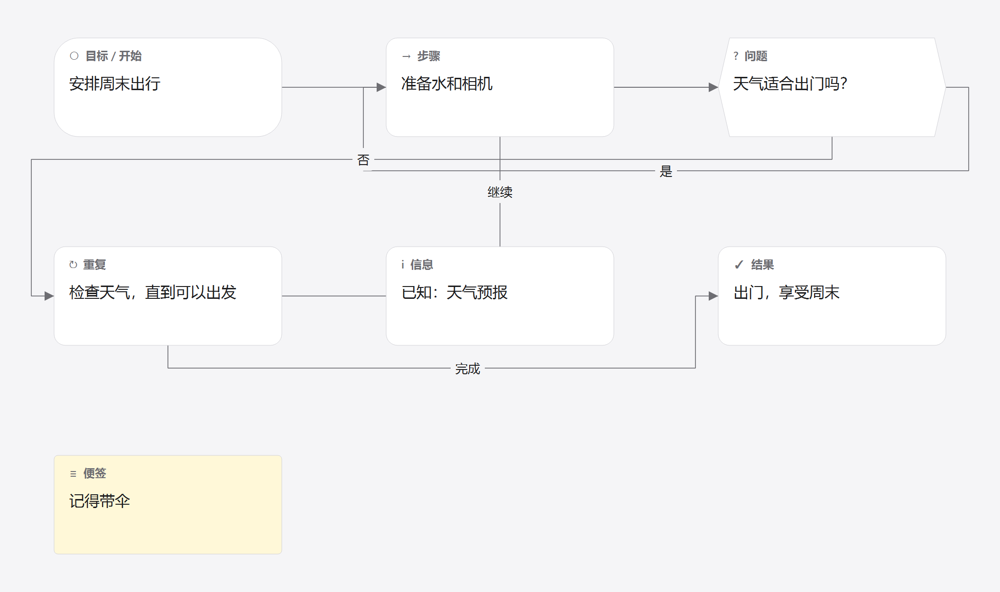
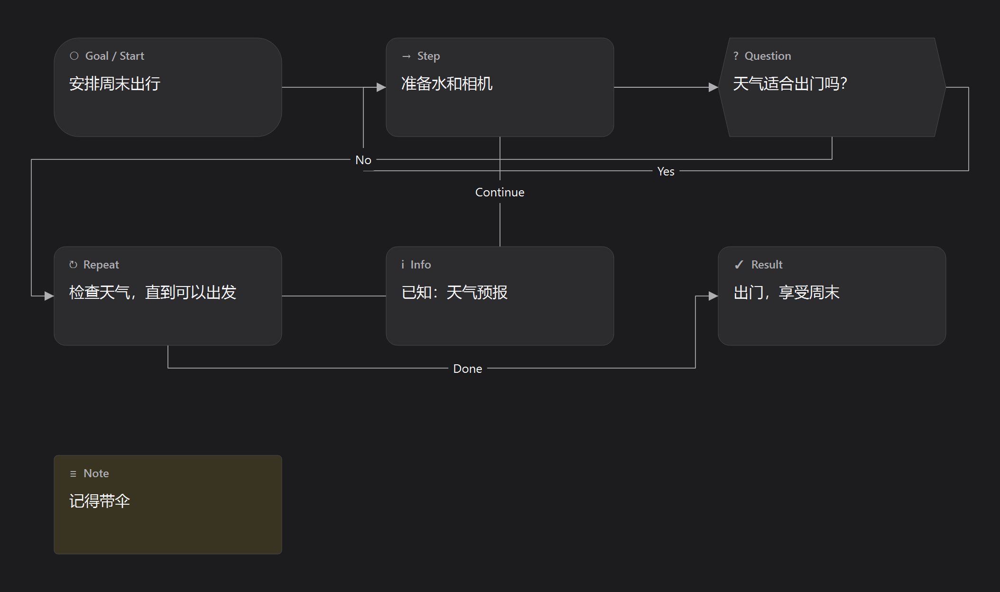

# 节点语义与渲染参考

参考输入为 `fixtures/v1_auto_labels.flowpad`，四张图由 Desktop 0.1.2 的实际 CanvasScene/ImageExporter
在 Qt 6.8.3、Windows 原生平台重新生成，2x 导出，2108×1248 像素。用户正文始终保持中文。

| 中文浅色 | English 深色 |
| --- | --- |
|  |  |

另有 `reference/desktop-en-light.png`、`reference/desktop-zh-dark.png`。
这些是 Qt 桌面的语义/布局参考，不要求 HTML Canvas 像素一致；VS Code 必须使用宿主主题与高对比配色。

| type | 标题 | 含义 | 默认出口 |
| --- | --- | --- | --- |
| goalStart | 目标 / 开始 · Goal / Start | 要解决的问题或起点 | 空 |
| step | 步骤 · Step | 下一步要做的事 | 空 |
| question | 问题 · Question | 判断条件 | right 是/Yes；bottom 否/No |
| repeat | 重复 · Repeat | 重复什么、何时停止 | right 继续/Continue；bottom 完成/Done |
| info | 信息 · Info | 已知信息或材料 | 空 |
| result | 结果 · Result | 最终结果 | 空 |
| note | 便签 · Note | 提醒或想法 | 不提供流程端口，不可连边 |

当前 Qt 图形：goalStart 大圆角，question 六边形轮廓，note 小圆角便签，其余圆角矩形。
类型是语义主键，不从形状、颜色或译文反推。所有非 note 节点均提供四边中点端口。
显示标题、占位提示和未自定义的默认出口随语言切换，正文、文档标题和用户连线标签不翻译。

## 行为验收序列（供 V2–V5 执行）

1. 打开 shared fixture，七类卡片和稳定 ID/位置/文字一致，不因首次布局产生文档更改。
2. 问题和重复的默认标签按 autoLabel 展示；切换语言只改变系统文案。
3. 将自动“是”改为自定义“是”，保存重开后切换 English，仍显示“是”。
4. 拖动一组卡片，临时预览中仅刷新受影响连线；松手提交一次移动，Esc 完整取消。
5. 编辑正文允许换行、纯文本粘贴与中文组合输入；Ctrl+Enter 提交、Esc 取消，候选窗另验。
6. 删除节点及相关边为一次提交；撤销同时恢复未知字段。复制时生成新 ID 并保留内部边。
7. 空白处平移/缩放，不显示点阵或网格吸附；连线端口吸附保留。
8. 外部改坏 JSON 后保留最后有效视图，禁用提交；修好后从最新 TextDocument 恢复。

复现参考图（已构建 Desktop 测试工具，Qt 插件 PATH 配置见桌面构建说明）：

```powershell
desktop/build/release/flowpad_contract_references.exe -platform windows spec/fixtures/v1_auto_labels.flowpad spec/reference
```

参考图不包含选择框、端口圆点或应用工具栏；端口与手势行为以文字序列和生产交互回归为准。
